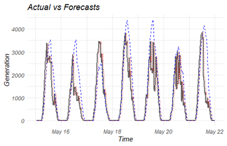
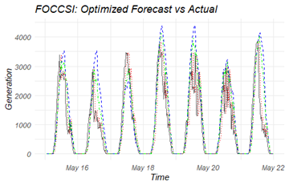
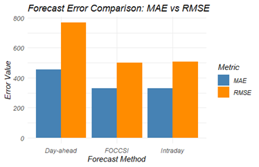
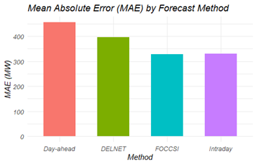

# FOCCSI and DELNET: Solar Forecast Evaluation – Netherlands (May 2024)

**Author:** Sultan Al-Maskari  
**Date:** 18-May-2025  

---

## 📌 Objective

This project applies and compares two forecast combination techniques:

- **FOCCSI** (Forecast Combination with Correlation-based Static Integration)
- **DELNET** (Dynamic Elastic Net Regression)

The evaluation is based on short-term solar power forecasts in the Netherlands from **15–21 May 2024**, with data from the **ENTSO-E Transparency Platform**.

---

## 📊 Data Overview

| Feature           | Value                         |
|-------------------|-------------------------------|
| Source            | ENTSO-E Transparency Platform |
| Region            | Netherlands (Solar only)      |
| Period            | 15–21 May 2024                |
| Resolution        | 15-minute intervals           |
| Forecasts Used    | `forecast_d1` (Day-ahead), `forecast_d` (Intraday) |
| Actual Generation | Real solar output             |
| Data Points       | 668                           |

---

## 🧪 Methods

### 1. FOCCSI

- Static combination of day-ahead and intraday forecasts
- Optimized to minimize MAE
- **Optimal Weight Found**: 95% intraday + 5% day-ahead
- Output column: `foccsi`

### 2. DELNET

- Rolling Elastic Net regression (α = 0.5)
- Training window: 5 days (480 time steps)
- Prediction horizon: 1 day
- Output column: `foccsi_delnet`

---

## 📈 Evaluation Metrics

| Method      | MAE (MW) | RMSE (MW) |
|-------------|----------|-----------|
| Day-ahead   | 456      | 768       |
| Intraday    | 330      | 505       |
| FOCCSI      | 329      | 502       |
| DELNET      | 397      | 547       |

---

## 🖼️ Visual Results

### 1. Actual vs Forecasts (All Methods)



---

### 2. FOCCSI: Optimized Forecast vs Actual



---

### 3. Forecast Error Comparison: MAE vs RMSE



---

### 4. MAE by Forecast Method



---

## 📚 Reference

Nikodinoska, D., Käso, M., & Müsgens, F. (2022).  
*Solar and wind power generation forecasts using elastic net in time-varying forecast combinations*.  
**Applied Energy, 306**, 117983.  
[DOI: 10.1016/j.apenergy.2021.117983](https://doi.org/10.1016/j.apenergy.2021.117983)

---

## 📁 Repository Structure

```
FOCCSI/
├── data/
│   ├── merged.csv
│   ├── foccsi_results.csv
│   └── delnet_results.csv
├── plots/
│   ├── actual_vs_forecast.png
│   ├── foccsi_optimized.png
│   ├── error_comparison_mae_rmse.png
│   └── mae_by_method.png
├── scripts/
│   └── model_evaluation.R
├── README.md
```

---

## 🛠️ Tools Used

- R & RStudio
- Packages: `dplyr`, `ggplot2`, `lubridate`, `glmnet`, `readr`, `tidyr`